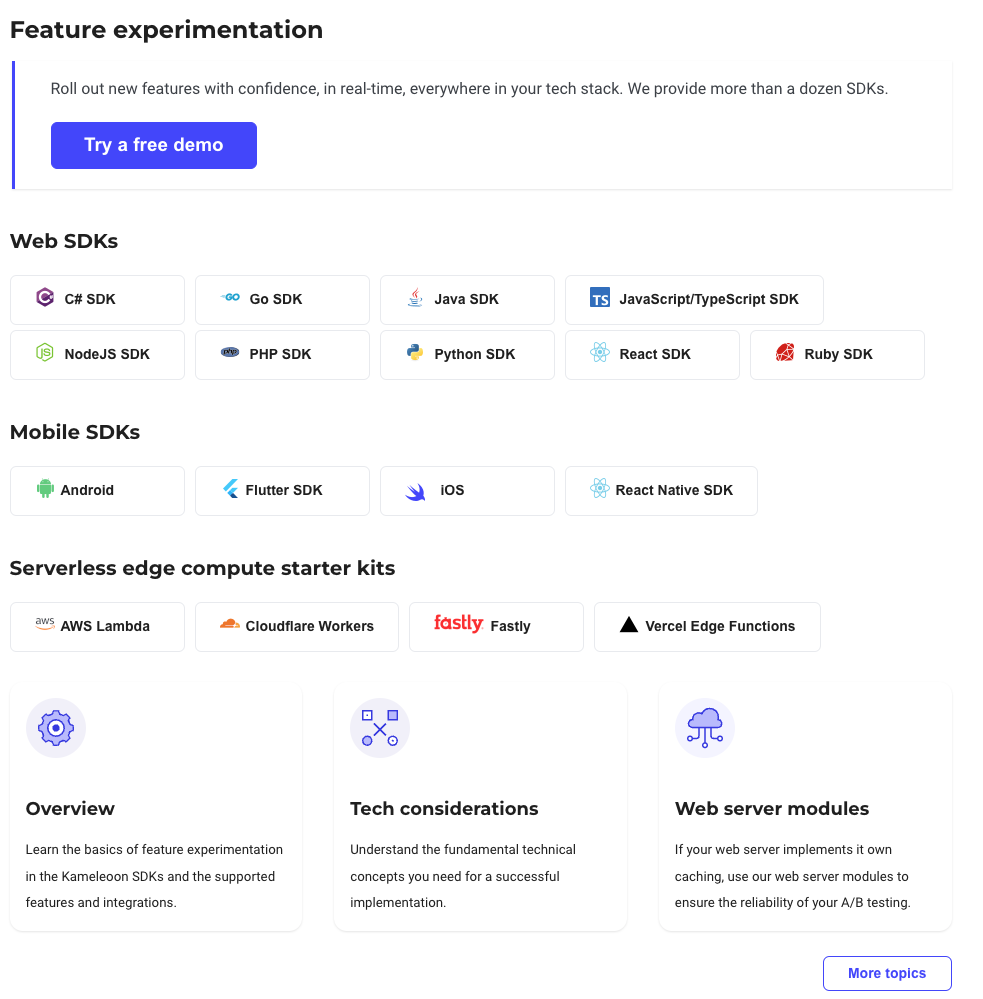
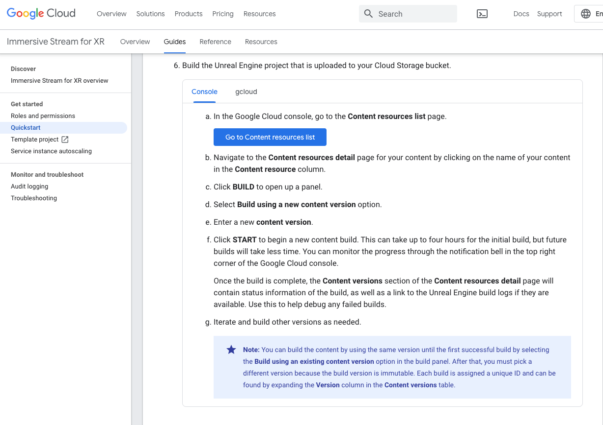

# Writing samples

Here a few of my writing samples. 

Unfortunately, you won't find any work from my time on [Google Stadia](https://stadia.google.com/gg/). It was a incredibly fun project, and I'm very proud of a lot of the work I did there. However, the documentation was never made public, so sadly, I cannot share it. Similarly, the work I did at Dematic was incredibly impactful to the organization, but as it was internal documentation, I cannot share that either. 

## Sample 1: Kameleoon developer docs

My most current work is on the [Kameleoon Developer Documentation](https://developers.kameleoon.com/). I'm currently working on revamping and rewriting, well, just about everything. But two new pages I've written entirely include the [homepage](https://developers.kameleoon.com) and the [Feature experimentation demo](https://developers.kameleoon.com/feature-management-and-experimentation/demo-feature-experimentation/). 

## Sample 2: Immersive Stream for XR (Google)

This project was built by the Google Cloud team in collaboration the Stadia team. Because of the similarities in their technology stack with Stadia, I was asked to help them create some docs for their launch. 

These docs have been updated since I last worked on them, but the [Quickstart](https://cloud.google.com/immersive-stream/xr/docs/quickstart) and [Overview](https://cloud.google.com/immersive-stream/xr/docs/concept) pages are pretty close to what they looked like at launch. 

## Sample 3: This website. 

You can consider this whole site to be a writing sample (if a little informal). It was built in [Docusaurus](https://docusaurus.io/), a static-site generator created by Meta (Facebook). I put it together in one evening (but I'll try to keep adding to it).

